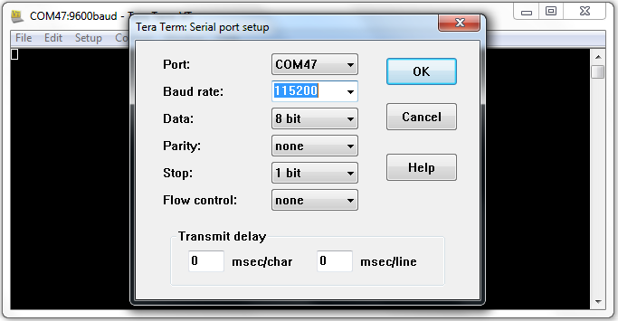

# TeseoLocation
This repo contains a GPSProvider example applications based on
mbed OS and built with [mbed-cli](https://github.com/ARMmbed/mbed-cli) meant for building an executable.

Please browse to subdirectories for specific documentation.

Getting Started
===============


Pre-Requisites
--------------


To build this, you need to have a computer with the following software installed:

* [CMake](http://www.cmake.org/download/).
* [mbed-cli](https://github.com/ARMmbed/mbed-cli). Please note that **mbed-cli has its own set of dependencies**, listed in the installation instructions.
* [Python](https://www.python.org/downloads/).
* [ARM GCC toolchain 4.9.x](https://launchpad.net/gcc-arm-embedded/+milestone/4.9-2015-q3-update).
* A serial terminal emulator (e.g. screen, pySerial, cu).
* If the OS used is Windows, the serial driver of the board has to be correctly installed.
	* For boards with mbed interface firmware the installation instructions are located (here)[https://developer.mbed.org/handbook/Windows-serial-configuration]

In order to use GPSProvider in mbed OS you need one the following hardware combination:

* A supported target, such as the [NUCLEO-F401RE](http://www.st.com/en/evaluation-tools/nucleo-f401re.html), with an external GPS peripheral, such as an X-NUCLEO-GNSS1A1.


The [`GPSProvider`module](https://github.com/apalmieriGH/GPSProvider) provides the GPS APIs on mbed OS.

Targets for GPS
---------------

The following targets have been tested and work with these examples:

* Boards with an ST shield plugged in:
	* NUCLEO-F401RE

Building and testing the examples
---------------------------------

__To build an example:__

1. Clone the repository containing the example:

	```
	$ git clone https://github.com/apalmieriGH/TeseoLocation.git
	```

	or, alternatively,

	```
	$ mbed import https://github.com/apalmieriGH/TeseoLocation.git
	```


	**Tip:** If you don't have GitHub installed, you can [download a zip file](https://github.com/apalmieriGH/TeseoLocation/archive/master.zip) of the repository.

2. Update the source tree:

	```
	$ mbed update
	```

3. Run the build:

	```
	$ mbed compile -t <ARM | GCC_ARM> -m <YOUR_TARGET>
	```

4. Exporting to desktop IDEs

	```
	$ mbed export -i <UVISION | GCC_ARM | IAR | COIDE> -m <YOUR_TARGET>
	```


	**Note:** Please, refer to [mbed-cli](https://github.com/ARMmbed/mbed-cli) for details about tool guidelines.


__To run the application on your board:__

1. Connect your mbed board to your computer over USB. It appears as removable storage.

2. When you run the ``mbed compile`` command, as you did above, mbed cli creates a BIN or an HEX file in a ```BUILD/<target-name>/<toolchain>``` directory under the example's directory. Drag and drop the file to the removable storage.


__TeseoLocation application description:__

In this application, real time GNSS data received by the Teseo-LIV3F device can be displayed through a serial connection and a serial terminal on a PC. Furthermore the user can run commands enabling three [advanced features](https://github.com/apalmieriGH/Teseo-LIV3F):
* Geofencing
* Odometer
* Data Logging

A serial connection should be set up between the Nucleo and the X-NUCLEO-GNSS1A1 boards and the PC with the following parameters:
* baud rate: 115200
* data: 8 bit
* parity: none
* stop: 1bit
* flow control: none
* New-line (Tx/Rx): CR

	
	
	**figure 1** Serial connection parameters


